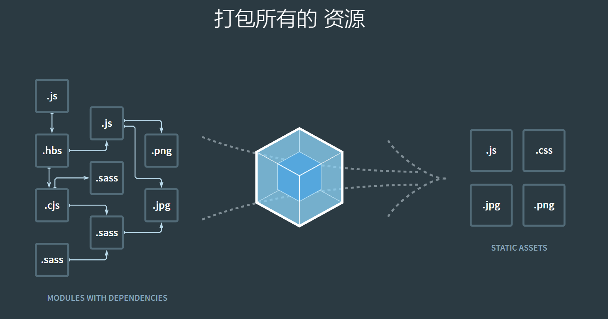

# webpack从入门到进阶

# 第1章 课程介绍

## 学什么

- [webpack官网](https://www.webpackjs.com)

> 本质上，*webpack* 是一个现代 JavaScript 应用程序的*静态模块打包器(module bundler)*。当 webpack 处理应用程序时，它会递归地构建一个*依赖关系图(dependency graph)*，其中包含应用程序需要的每个模块，然后将所有这些模块打包成一个或多个 *bundle*。



- 代码转译
- 模块合并
- 混淆压缩
- 代码分割
- 自动刷新
- 代码校验
- 自动部署

## 课程安排

- webpack基础配置
- webpack高级配置
- webpack性能优化
- tapable钩子
- AST抽象语法树的应用
- webpack原理分析, 手写webpack
- 手写常见的loader和plugin

## 学习前提

- JS基础
- ES6 / ES7 语法
- node基础
- npm的基本使用

## 课程目标

- 掌握webpack的安装
- 掌握webpack的基础配置
- 掌握loader的配置
- 掌握plugin的配置
- 了解webpack性能优化
- 了解webpack中的tapable
- 了解AST的应用
- 深入学习webpack原理，手写webpack

# 第2章 webpack基础

## webpack的安装

注意：请先自行安装[nodejs](https://nodejs.org)最新版的环境

- 全局安装webpack

  `npm i webpack webpack-cli -g`

- 项目中安装webpack (推荐)

  `npm i webpack webpack-cli -D`

## webpack的使用

### webpack-cli

npm 5.2 以上的版本中提供了一个`npx`命令

npx 想要解决的主要问题，就是调用项目内部安装的模块，原理就是在`node_modules`下的`.bin` 目录中找到对应的命令执行

使用webpack命令：`npx webpack`

webpack4.0之后可以实现0配置打包构建，0配置的特点就是限制较多，无法自定义很多配置

开发中常用的还是使用webpack配置进行打包构建

### webpack配置

webpack有四大核心概念:

- 入口(entry): 程序的入口js
- 输出(output): 打包后存放的位置
- loader: 用于对模块的源代码进行转换
- 插件(plugins): 插件目的在于解决 loader无法实现的**其他事**

1. 配置webpack.config.js
2. 运行`npx webpack`

```js
const path = require('path')

module.exports = {
  // 入口文件配置
  entry: './src/index.js',
  // 出口文件配置项
  output: {
    // 输出的路径，webpack2起就规定必须是绝对路径
    path: path.join(__dirname, 'dist'),
    // 输出文件名字
    filename: 'bundle.js'
  },
  mode: 'development' // 默认为production, 可以手动设置为development, 区别就是是否进行压缩混淆
}
```

将`npx webpack`命令配置到`package.json`的脚本中

1. 配置`package.json`
2. 运行`npm run build`

```json
{
  "name": "webpack-basic",
  "version": "1.0.0",
  "main": "index.js",
  "license": "MIT",
  "scripts": {
    "build": "webpack"
  },
  "devDependencies": {
    "webpack": "^4.30.0",
    "webpack-cli": "^3.3.1"
  }
}
```

### 开发时自动编译工具

每次要编译代码时，手动运行 `npm run build` 就会变得很麻烦。

webpack 中有几个不同的选项，可以帮助你在代码发生变化后自动编译代码：

1. webpack's Watch Mode
2. webpack-dev-server
3. webpack-dev-middleware

多数场景中，可能需要使用 `webpack-dev-server`，但是不妨探讨一下以上的所有选项。

#### watch

在`webpack`指令后面加上`--watch`参数即可

主要的作用就是监视本地项目文件的变化, 发现有修改的代码会自动编译打包, 生成输出文件

1. 配置`package.json`的scripts`"watch": "webpack --watch"`

2. 运行`npm run watch`

以上是cli的方式设置watch的参数

还可以通过配置文件对watch的参数进行修改：

```js
const path = require('path')

// webpack的配置文件遵循着CommonJS规范
module.exports = {
  entry: './src/main.js',
  output: {
    // path.resolve() : 解析当前相对路径的绝对路径
    // path: path.resolve('./dist/'),
    // path: path.resolve(__dirname, './dist/'),
    path: path.join(__dirname, './dist/'),
    filename: 'bundle.js'
  },
  mode: 'development',
  watch: true
}
```

运行`npm run build`

#### webpack-dev-server (推荐)

1. 安装`devServer`：

   `devServer`需要依赖`webpack`，必须在项目依赖中安装`webpack`

   `npm i webpack-dev-server webpack -D`

2. index.html中修改 `<script src="/bundle.js"></script>`

3. 运行：`npx webpack-dev-server`

4. 运行：`npx webpack-dev-server --hot --open --port 8090`

5. 配置`package.json`的scripts：`"dev": "webpack-dev-server --hot --open --port 8090"`

6. 运行`npm run dev`

devServer会在内存中生成一个打包好的`bundle.js`，专供开发时使用，打包效率高，修改代码后会自动重新打包以及刷新浏览器，用户体验非常好

以上是cli的方式设置devServer的参数

还可以通过配置文件对devServer的参数进行修改：

1. 修改`webpack.config.js`

```js
const path = require('path')

module.exports = {
  // 入口文件配置
  entry: './src/index.js',
  // 出口文件配置项
  output: {
    // 输出的路径，webpack2起就规定必须是绝对路径
    path: path.join(__dirname, 'dist'),
    // 输出文件名字
    filename: 'bundle.js'
  },
  devServer: {
    port: 8090,
    open: true,
    hot: true
  },
  mode: 'development'
}
```

2. 修改package.json的scripts: `"dev": "webpack-dev-server"`
3. 运行`npm run dev`

#### html插件

1. 安装html-webpack-plugin插件`npm i html-webpack-plugin -D`
2. 在`webpack.config.js`中的`plugins`节点下配置

```js
const HtmlWebpackPlugin = require('html-webpack-plugin')

plugins: [
    new HtmlWebpackPlugin({
        filename: 'index.html',
        template: 'template.html'
    })
]
```

1. devServer时根据模板在express项目根目录下生成html文件(类似于devServer生成内存中的bundle.js)
2. devServer时自动引入bundle.js
3. 打包时会自动生成index.html

#### webpack-dev-middleware

`webpack-dev-middleware` 是一个容器(wrapper)，它可以把 webpack 处理后的文件传递给一个服务器(server)。 `webpack-dev-server` 在内部使用了它，同时，它也可以作为一个单独的包来使用，以便进行更多自定义设置来实现更多的需求。

1. 安装 `express` 和 `webpack-dev-middleware`：

   `npm i express webpack-dev-middleware -D`

2. 新建`server.js`

   ```js
   const express = require('express');
   const webpack = require('webpack');
   const webpackDevMiddleware = require('webpack-dev-middleware');
   const config = require('./webpack.config.js');
   
   const app = express();
   const compiler = webpack(config);
   
   app.use(webpackDevMiddleware(compiler, {
     publicPath: '/'
   }));
   
   app.listen(3000, function () {
     console.log('http://localhost:3000');
   });
   ```

3. 配置`package.json`中的scripts:`"server": "node server.js"`

4. 运行: `npm run server`

注意: 如果要使用`webpack-dev-middleware`, 必须使用`html-webpack-plugin`插件, 否则html文件无法正确的输出到express服务器的根目录

#### 小结

只有在开发时才需要使用自动编译工具, 例如: webpack-dev-server

项目上线时都会直接使用webpack进行打包构建, 不需要使用这些自动编译工具

自动编译工具只是为了**提高开发体验**

### 处理css

1. 安装`npm i css-loader style-loader -D`
2. 配置`webpack.config.js`

```js
  module: {
    rules: [
      // 配置的是用来解析.css文件的loader(style-loader和css-loader)
      {
        // 用正则匹配当前访问的文件的后缀名是  .css
        test: /\.css$/,
        use: ['style-loader', 'css-loader'] // webpack底层调用这些包的顺序是从右到左
      }
    ]
  }
```

loader的释义:

1. css-loader: 解析css文件
2. style-loader: 将解析出来的结果 放到html中, 使其生效

### 处理less 和 sass

`npm i less less-loader sass-loader node-sass -D`

```js
{ test: /\.less$/, use: ['style-loader', 'css-loader', 'less-loader'] },
```

```js
{ test: /\.scss$/, use: ['style-loader', 'css-loader', 'sass-loader'] }
```

### 处理图片和字体

1. `npm i file-loader url-loader -D`

url-loader封装了file-loader

```js
{
    test: /\.(png|jpg|gif)/,
    use: [{
        loader: 'url-loader',
        options: {
          // limit表示如果图片大于5KB，就以路径形式展示，小于的话就用base64格式展示
            limit: 5 * 1024
        }
    }]
}
```

### babel

1. `npm i babel-loader @babel/core @babel/preset-env webpack -D`

2. 如果需要支持更高级的ES6语法, 可以继续安装插件:

   `npm i @babel/plugin-proposal-class-properties -D`

   也可以根据需要在babel官网找插件进行安装

```js
{
  test: /\.js$/,
  use: {
    loader: 'babel-loader',
    options: {
      presets: ['@babel/env'],
      plugins: ['@babel/plugin-proposal-class-properties']
    }
  },
  exclude: /node_modules/
}
```

官方更建议的做法是在项目根目录下新建一个`.babelrc`的babel配置文件

```json
{
  "presets": ["@babel/env"],
  "plugins": ["@babel/plugin-proposal-class-properties"]
}
```

如果需要使用`generator`，无法直接使用babel进行转换，因为会将`generator`转换为一个`regeneratorRuntime`，然后使用`mark`和`wrap`来实现`generator`

但由于babel并没有内置`regeneratorRuntime`，所以无法直接使用

需要安装插件:

​	`npm i @babel/plugin-transform-runtime -D`

同时还需安装运行时依赖:

​	`npm i @babel/runtime -D`

在`.babelrc`中添加插件:

```json
{
  "presets": [
    "@babel/env"
  ],
  "plugins": [
    "@babel/plugin-proposal-class-properties",
    "@babel/plugin-transform-runtime"
  ]
}
```

如果需要使用ES6/7中对象原型提供的新方法，babel默认情况无法转换，即使用了`transform-runtime`的插件也不支持转换原型上的方法

需要使用另一个模块:

​	`npm i @babel/polyfill -S`

该模块需要在使用新方法的地方直接引入:

​	`import '@babel/polyfill'`

# 第2章 webpack高级

# 第3章 webpack原理


